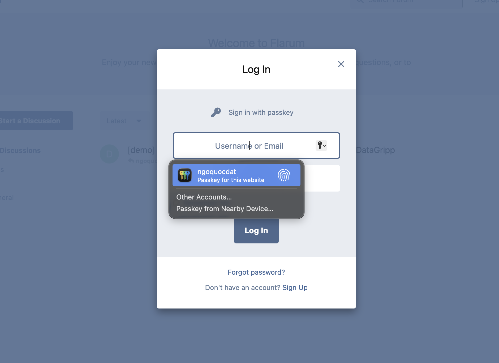
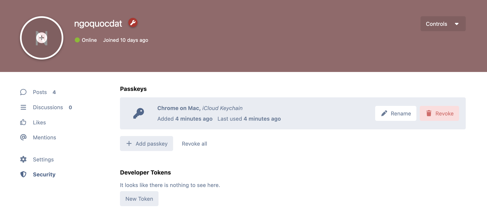
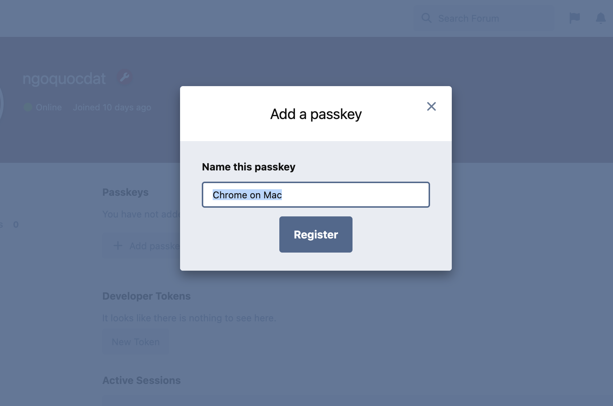
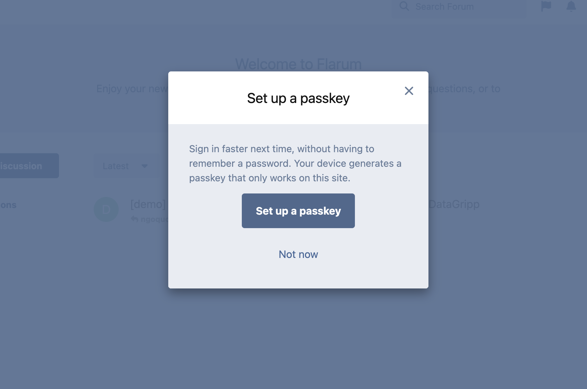
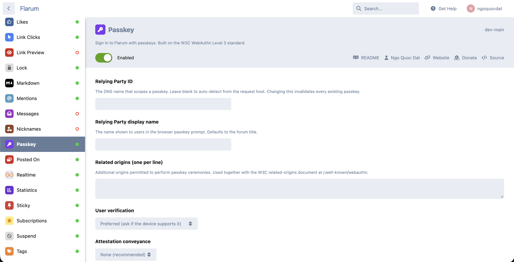
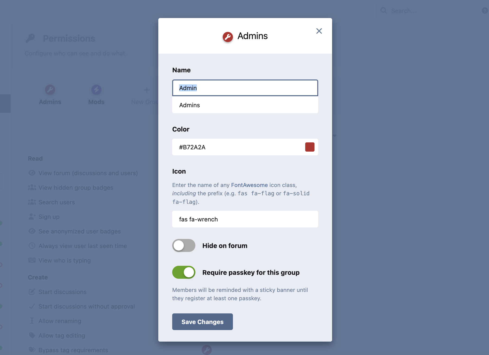

# Flarum Passkey

[](LICENSE.md)
[](https://packagist.org/packages/datlechin/flarum-passkey)
[](https://packagist.org/packages/datlechin/flarum-passkey)

A [Flarum](https://flarum.org) extension that adds passkey sign-in alongside the existing password login. Passkeys live next to passwords, so existing accounts and recovery flows keep working.

Built on W3C WebAuthn Level 3 with [`web-auth/webauthn-lib`](https://github.com/web-auth/webauthn-lib) on the server and [`@simplewebauthn/browser`](https://github.com/MasterKale/SimpleWebAuthn) in the browser.



## Features

### Sign in

- Sign in with passkey button in the standard login modal.
- Conditional UI / autofill: saved passkeys appear in the username field's autofill dropdown.
- Discoverable credentials, so users can sign in without typing a username.
- Cross-device hybrid (CTAP 2.2) for QR-code sign-in from a phone.
- Built-in IP throttler on the login endpoint.

### Onboarding

- Suggest a passkey modal after a successful password sign-in. Dismissable, with a 30-day cool-down.
- Per-group "Require passkey" toggle on the standard Edit Group modal. Members of flagged groups see a sticky banner until they register one.

### Manage

- Add, rename, revoke from the user security page.
- Bulk Revoke all action that wipes every passkey on the account in one call.
- Site moderators can revoke any user's passkeys via the API for support cases.
- Authenticator type next to the device label (iCloud Keychain, Google Password Manager, Windows Hello, 1Password, Bitwarden, YubiKey 5, etc.) when the AAGUID is recognised. Falls back to a synced/device-only hint otherwise.



| Add passkey modal | Suggest passkey after a password sign-in |
|---|---|
|  |  |

### Security signals

- Counter regression detection on every assertion, with a notification email and a `PasskeyCounterRegression` event. This is the canonical clone-detection signal in WebAuthn.
- BS flag change detection: the owner is mailed when an authenticator transitions between synced and device-only.
- Notification email on every revoke (single or bulk).
- All emails are queued via Flarum's `SendInformationalEmailJob`.

### Admin

- Settings page: relying party id, display name, related origins, user verification, attestation, throttle.
- Per-group "Require passkey" toggle on the standard Edit Group modal.
- W3C related origins served at `/.well-known/webauthn`.





### Other

- W3C WebAuthn Level 3, FIDO2.
- Optional `flarum/gdpr` integration: passkeys are exported on data request, and revoked when the user is anonymised or deleted.
- Locales: English, Vietnamese.

## Installation

```sh
composer require datlechin/flarum-passkey:"*"
php flarum migrate
php flarum cache:clear
```

## Updating

```sh
composer update datlechin/flarum-passkey:"*"
php flarum migrate
php flarum cache:clear
```

## Configuration

Open `Admin → Extensions → Passkey`.

| Setting | Default | What it does |
|---|---|---|
| Relying Party ID | (auto from request host) | DNS suffix that scopes the passkey. Changing it invalidates every existing passkey. |
| Relying Party display name | forum title | Name shown in the browser passkey prompt. |
| Related origins | empty | Other origins permitted to perform a passkey ceremony, in combination with the well-known document. |
| User verification | preferred | Whether to require biometric/PIN. |
| Attestation conveyance | none | Whether to ask the authenticator for an attestation chain. Most consumer forums leave this at `none`. |
| Login attempts per minute per IP | 10 | Throttler on `/api/passkey/login`. |

The "Require passkey" toggle for each group lives on the Edit Group modal in `Admin → Permissions`.

### Relying Party ID

The RP ID is the part of the origin that scopes a passkey. It must be either the exact host or a registrable suffix of it (`forum.example.com`, or `example.com` if you want passkeys to work across all subdomains).

Changing the RP ID after users have registered passkeys silently invalidates every saved credential, because the browser hashes the RP ID into each credential's identity. Confirm before saving, and prefer the empty default unless you have a specific cross-subdomain requirement.

### Related origins

If the same Flarum is reachable from more than one origin (for example, a forum at `forum.example.com` embedded in a portal at `app.example.com`), list each non-canonical origin in this setting. The extension serves the W3C document at `/.well-known/webauthn` so browsers performing a ceremony from a related origin can confirm they are allowed to reach the configured RP ID.

### Recovery

If a user loses every passkey, they sign in with their password and the existing forgot-password flow handles forgotten passwords. The extension does not change that path.

If a group has "Require passkey" turned on and an admin needs to recover a stuck user, the admin can revoke that user's passkeys via the API. The sticky banner reappears with a fresh registration prompt on next page load.

## Events

Listeners subscribe via the standard Flarum event bus.

| Event | Fired when |
|---|---|
| `Datlechin\Passkey\Event\PasskeyRegistered` | A new passkey has been verified and persisted. |
| `Datlechin\Passkey\Event\PasskeyRevoked` | A single passkey has been deleted via the API. |
| `Datlechin\Passkey\Event\PasskeyBulkRevoked` | The owner used the bulk-revoke action. Carries the count, fires once. |
| `Datlechin\Passkey\Event\PasskeyUsed` | A successful sign-in. `backupStateChanged` flags credentials whose BS bit moved. |
| `Datlechin\Passkey\Event\PasskeyCounterRegression` | An assertion failed the signature counter check. |
| `Flarum\User\Event\LoggedIn` | Also fires on a successful passkey sign-in. |

The web-auth library also emits `Webauthn\Event\BackupEligibilityChangedEvent` and `Webauthn\Event\BackupStatusChangedEvent` through the same bus.

## Development

```sh
cd packages/flarum-passkey
composer install
cd js && npm install && npm run dev
```

Integration tests:

```sh
composer test:setup
composer test:integration
```

PHPStan:

```sh
composer analyse:phpstan
```

## Sponsors

If this extension is useful to you, you can sponsor the work via [GitHub Sponsors](https://github.com/sponsors/datlechin) or [Buy Me a Coffee](https://buymeacoffee.com/ngoquocdat).

## Links

- [Packagist](https://packagist.org/packages/datlechin/flarum-passkey)
- [GitHub](https://github.com/datlechin/flarum-passkey)
- [Discuss](https://discuss.flarum.org/d/39230)
- [W3C WebAuthn Level 3](https://www.w3.org/TR/webauthn-3/)
- [FIDO Alliance Passkeys](https://fidoalliance.org/passkeys/)
